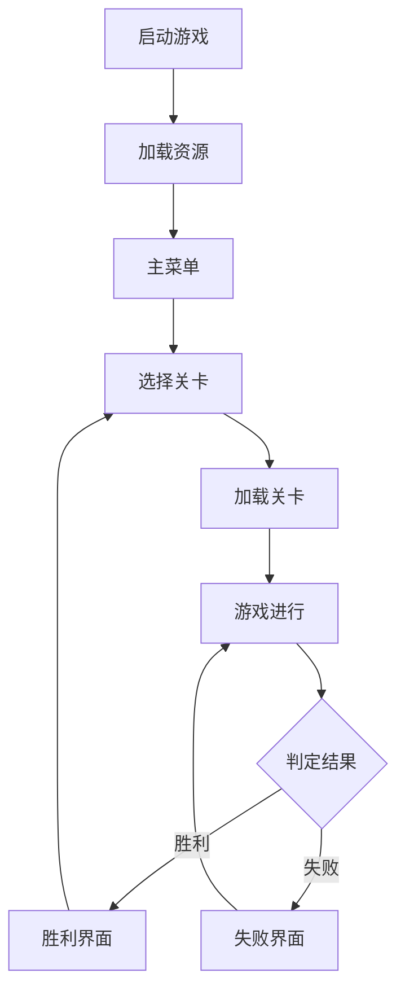
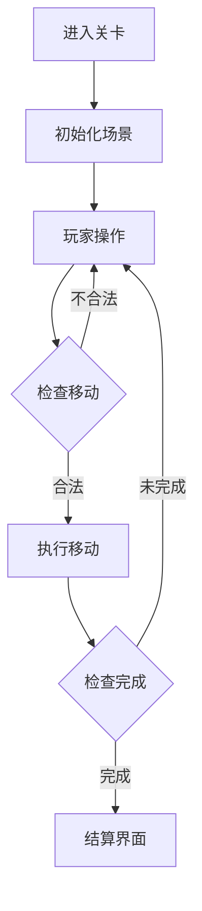

# Nuts Sort Master - CocosCreator 项目设计文档

## 1. 项目概述

### 1.1 开发环境
- 引擎: CocosCreator 3.x
- 语言: TypeScript
- 目标平台: Web, Android, iOS

### 1.2 项目结构
```
assets/
├── resources/          # 动态加载资源
│   ├── levels/        # 关卡配置文件
│   ├── prefabs/       # 预制体资源
│   │   ├── nuts/     # 螺丝预制体
│   │   ├── containers/ # 容器预制体
│   │   └── ui/       # UI预制体
│   ├── textures/     # 图片资源
│   │   ├── common/   # 通用图片
│   │   ├── nuts/     # 螺丝图片
│   │   └── ui/       # UI图片
│   └── sounds/       # 音效资源
├── scenes/           # 场景文件
│   ├── Loading.scene # 加载场景
│   ├── Main.scene    # 主菜单场景
│   └── Game.scene    # 游戏主场景
└── scripts/          # 脚本文件
    ├── core/         # 核心逻辑
    │   ├── managers/ # 管理器
    │   └── game/     # 游戏逻辑
    ├── ui/           # UI脚本
    │   ├── panels/   # 面板
    │   └── common/   # 通用组件
    └── utils/        # 工具类
```

## 2. 系统架构

### 2.1 核心管理器
- **GameManager**: 游戏全局管理
  - 游戏状态控制
  - 场景切换
  - 全局事件派发

- **LevelManager**: 关卡管理
  - 关卡配置加载
  - 关卡生成
  - 进度保存

- **UIManager**: UI管理
  - UI层级管理
  - 面板显示/隐藏
  - UI事件处理

- **AudioManager**: 音频管理
  - 音效播放
  - 背景音乐
  - 音量控制

- **StorageManager**: 存储管理
  - 游戏进度
  - 玩家数据
  - 设置信息

### 2.2 游戏对象
- **螺丝(Nut)**
  - 颜色属性
  - 移动行为
  - 状态管理

- **容器(Container)**
  - 容量管理
  - 排序规则
  - 状态检查

### 2.3 UI系统
- **主界面(MainUI)**
  - 开始游戏
  - 关卡选择
  - 设置面板

- **游戏界面(GameUI)**
  - 步数显示
  - 关卡信息
  - 暂停菜单

- **结算界面(ResultUI)**
  - 胜利/失败显示
  - 星级评价
  - 继续选项

## 3. 游戏流程

### 3.1 主要流程


### 3.2 关卡流程


## 4. 数据设计

### 4.1 关卡数据
- 关卡编号
- 最大步数
- 容器配置
- 螺丝初始状态
- 目标状态

### 4.2 玩家数据
- 当前进度
- 关卡星级
- 最佳记录
- 设置信息

## 5. 开发规划

### 5.1 第一阶段：基础框架
- 项目结构搭建
- 核心管理器实现
- 基础UI框架

### 5.2 第二阶段：核心玩法
- 螺丝移动系统
- 容器逻辑
- 关卡管理

### 5.3 第三阶段：UI系统
- 主界面
- 游戏界面
- 结算界面

### 5.4 第四阶段：完善优化
- 音效系统
- 存储系统
- 性能优化

## 6. 技术要点

### 6.1 性能优化
- 对象池管理
- 资源预加载
- 内存管理

### 6.2 扩展性设计
- 模块化结构
- 配置驱动
- 事件系统

## 7. 测试规划

### 7.1 测试范围
- 功能测试
- 性能测试
- 兼容性测试

### 7.2 测试重点
- 玩法核心逻辑
- UI交互响应
- 数据存储